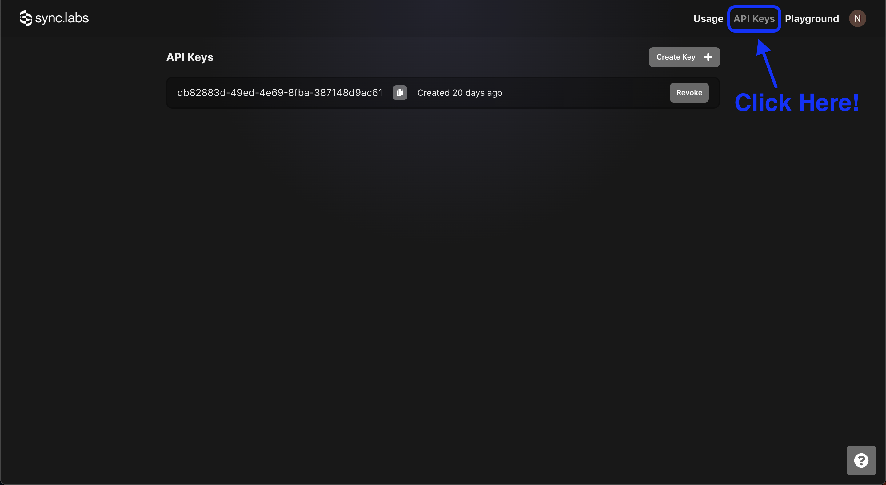
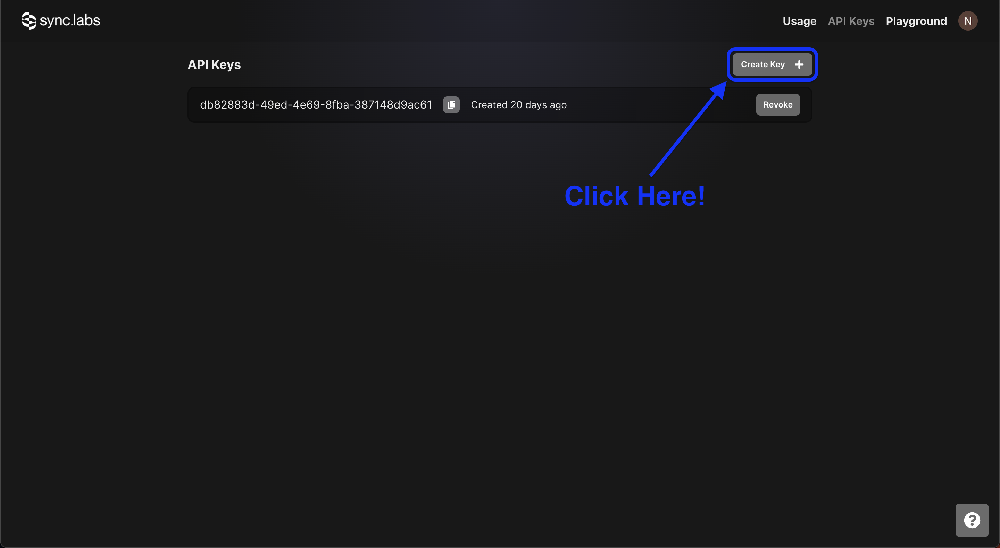
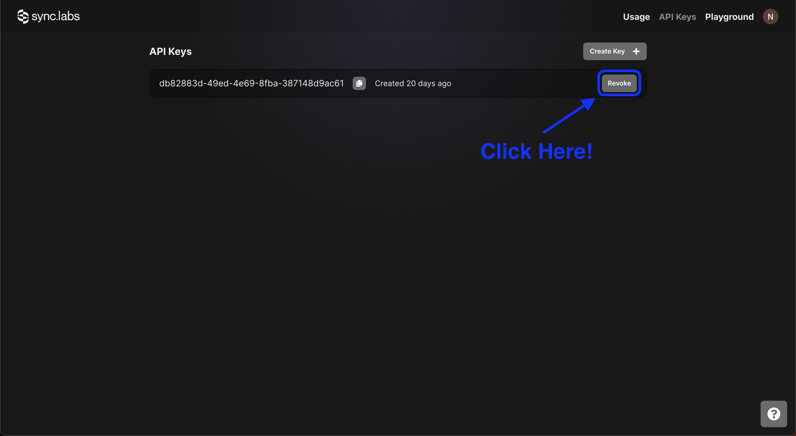
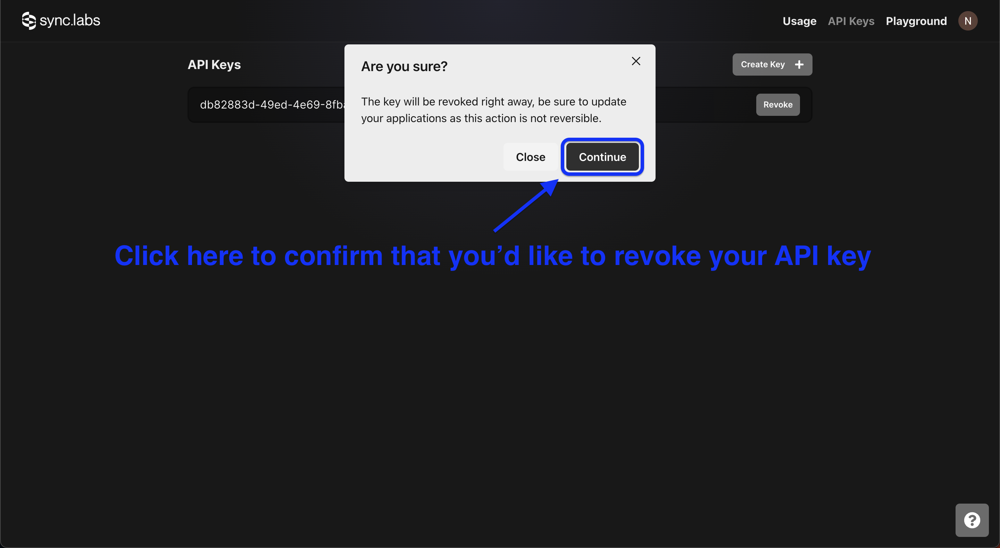

## Authentication

In order to make reqeuests to the API, you'll need to get your `sync-labs-api-key`. After you [create an account](https://app.synclabs.so/signup) and login, navigate to the `Api Keys` page.

From there, you can copy, create or revoke your API keys.

### Creating an API Key

You can create a new API key at any time by clicking the `Create Key +` button.

### Revoke an API Key

You can revoke an API Key at any time by clicking on the `Revoke` button next to the API Key you want to revoke.

This will immediately revoke the API Key and any requests using that API Key will fail.

**Step 1**

**Step 2**

