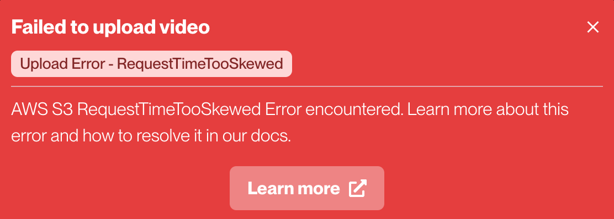
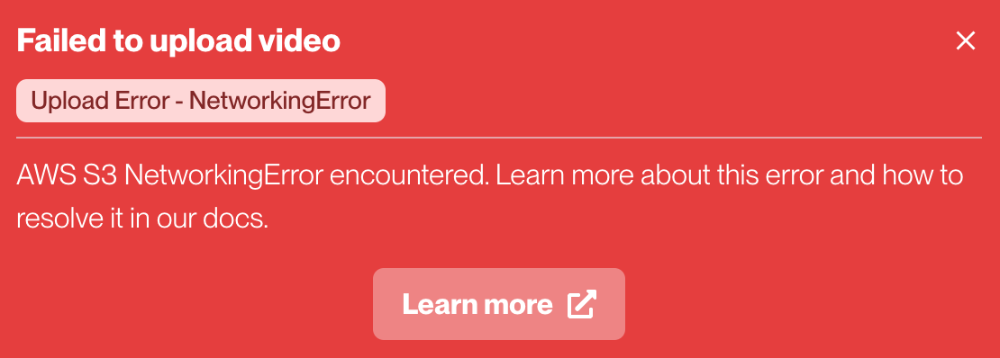
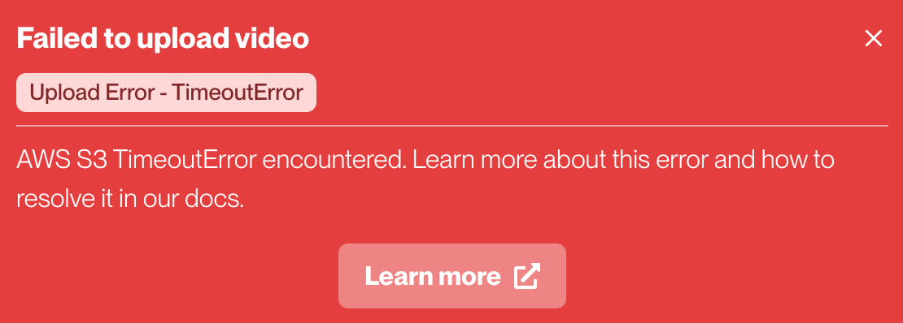

import { Callout } from "nextra-theme-docs";

## Web App Error Codes

Below are potential error codes that can be returned by the Sync Labs web app. If you encounter an error that is not listed below, please [report it to us](/errors#reporting-errors) and we'll be happy to help. 

### Reporting Errors

If you encounter any issues with the Sync Labs web app, we're here to help. You can report errors quickly and easily using one of the following methods:

1. **Send us a message:**
    - Within the [web app](https://app.synclabs.so/), click on the `Send us a message` tool at the bottom right of the screen.
    - Provide your name, email and a brief description of the issue, including the error code and message if available and what you were doing when the error occurred.
    
2. **Join our Slack channel:**
    - Access our dedicated [Slack channel](https://syncbetatesters.slack.com/join/shared_invite/zt-23592cxxg-sTjaMTkk2DO5yUcixzRWZg#/shared-invite/email) for immediate support.
    - Post your issue in the #bugs channel, including as much detail as possible.
    - Our team monitors this channel regularly and will respond as soon as possible.

### Upload Error - RequestTimeTooSkewed


This bug has occured for some users running Windows 10 and is typically caused by a mismatch in your computers system time and the time on the AWS server.

One way you can check is by running the below in the terminal:

```bash
$ curl http://s3.amazonaws.com -v 
$ date -u 
```

The first command will return the time on the AWS server, and the second command will return the time on your computer. If the times are off by more than **15 minutes**, you'll need to resynchronize your system's clock to resolve the problem.

{/* ### Upload Error - NetworkingError


### Upload Error - TimeoutError
 */}